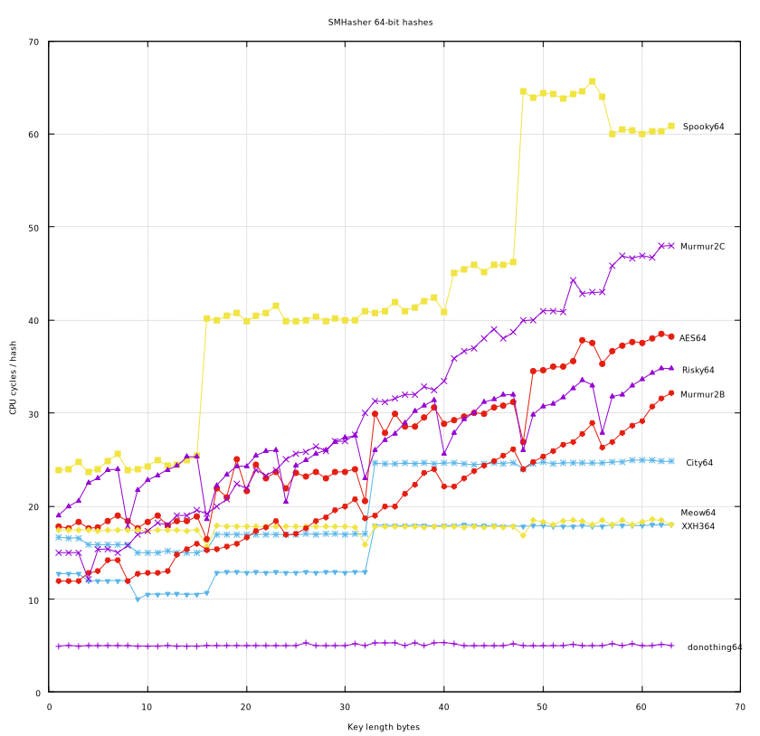
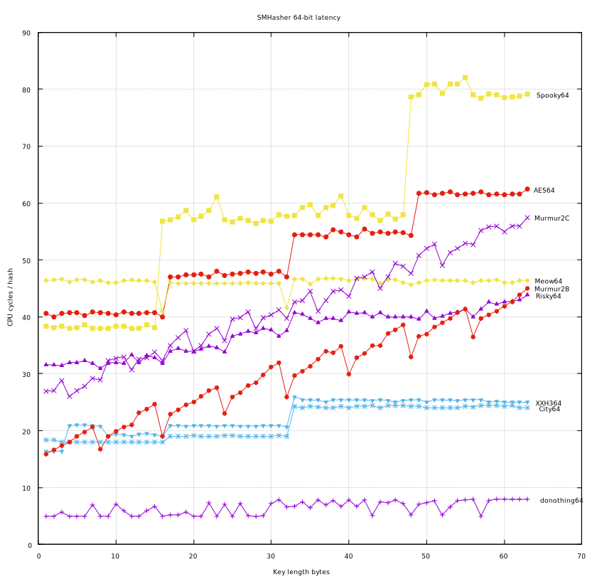
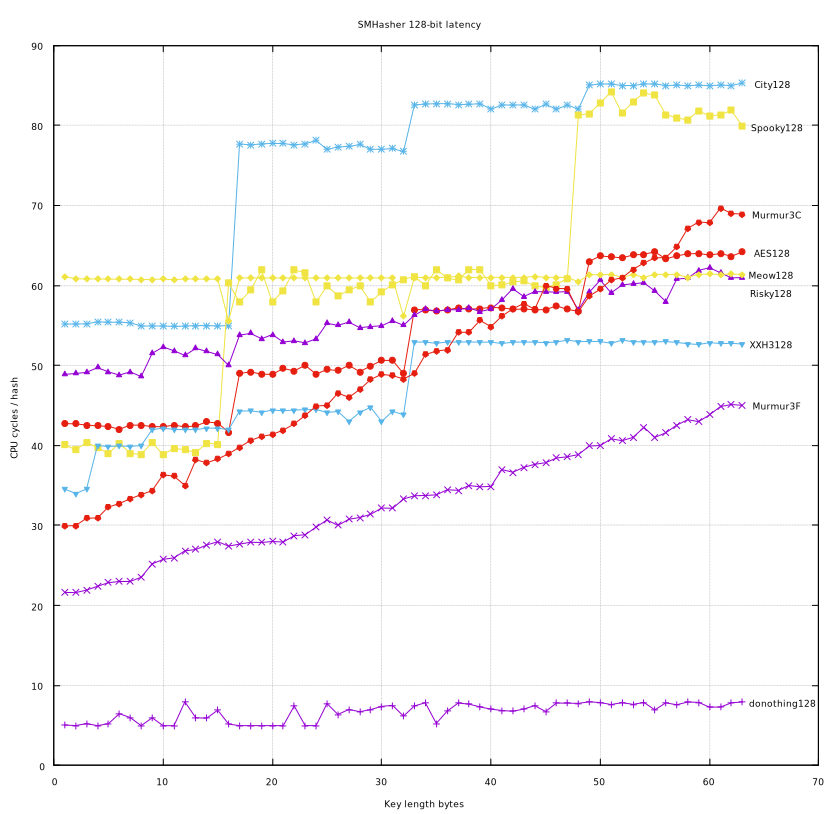

This is smhasher with a couple of hashes I added.

1. [AESTest.cpp](src/AESTest.cpp) and [AESHash.h](src/AESHash.h) are AES based hashes, these
require AES and AVX support on x64.

2. [RiskyTest.cpp](src/RiskyTest.cpp) and [RiskyHash.h](src/RiskyHash.h) are hashes derived from
[facil.io](https://github.com/boazsegev/facil.io) located in [fio.h](https://github.com/boazsegev/facil.io/blob/master/lib/facil/fio.h).

3. [Xxh3Test.cpp](src/Xxh3Test.cpp) and [xxh3.h](src/xxh3.h), [xxhash.c](src/xxhash.c), [xxhash.h](src/xxhash.h) are
hashes from [Cyan4973](https://github.com/Cyan4973/xxHash).

I merged the LongNeighborTest from [hmakholm](https://github.com/hmakholm/smhasher):

> # Fork information
>
> This fork of SMhasher is the home of a new test to discover
> hash collisions with small Hamming distance; see [LongNeighborTest](src/LongNeighborTest.md).
>
> The plan is to contribute this upstream (but given that the upstream repo has
> a numer of open pull requests, yet no commits since the "woo, we're on
> Github" commit three years ago, holding one's breath on that is probably not
> to be recommended).

There are two variations of the small hash value speed test.  The first is a
just calling hash() in a loop.  The second is calling hash() and feeding the
result into hash() seed (this is also used in
[rurban](https://github.com/rurban/smhasher)).  This causes the result of the
hash() to be needed immediately, causing the pipeline to flush.  I've dubbed
this a latency test, since this is probably how the hashes will be used in a
program:  a hash is usually used immediately after computing it (for a
hashtable lookup, for example).  The latency test adds a few CPU cycles to each
hash function, depending on how long it takes for the pipeline to flush.  This
is variable for each hash, some have longer latency than others.

Here are graphs for the 64 bit and 128 bit hashes as run on a i9-7960X
(skylake) using these gnuplot scripts: [plot64.gnuplot](plot64.gnuplot)
and [plot128.gnuplot](plot128.gnuplot).

And these are graphs for the 64 bit and 128 bit latency as run on a i9-7960X
(skylake) using these gnuplot scripts: [plot64lat.gnuplot](plot64lat.gnuplot)
and [plot128lat.gnuplot](plot128lat.gnuplot).

The cmake was changed to use the gcc flag '-march=native'.

To use the plot scripts, load them in gnuplot like this (I'm using Fedora 28):

```console
[5875]; git clone https://github.com/injinj/smhasher
[5876]; cd smhasher
[5877]; cmake src
[5878]; make
[5879]; gnuplot-qt

        G N U P L O T
        Version 5.0 patchlevel 6    last modified 2017-03-18

        Copyright (C) 1986-1993, 1998, 2004, 2007-2017
        Thomas Williams, Colin Kelley and many others

        gnuplot home:     http://www.gnuplot.info
        faq, bugs, etc:   type "help FAQ"
        immediate help:   type "help"  (plot window: hit 'h')

Terminal type set to 'qt'
gnuplot> load "plot64.gnuplot"
donothing64
City64
Spooky64
AES64
Risky64
Murmur2B
Murmur2C
```








Original SMHasher Readme:

## [SMHasher](https://github.com/aappleby/smhasher/wiki) is a test suite designed to test the distribution, collision, and performance properties of non-cryptographic hash functions.

This is the home for the [MurmurHash](https://github.com/aappleby/smhasher/tree/master/src) family of hash functions along with the [SMHasher](https://github.com/aappleby/smhasher/tree/master/src) test suite used to verify them. SMHasher is released under the MIT license. All MurmurHash versions are public domain software, and the author disclaims all copyright to their code.

SMHasher is a test suite designed to test the distribution, collision, and performance properties of non-cryptographic hash functions - it aims to be the [DieHarder](http://www.phy.duke.edu/~rgb/General/dieharder.php) of hash testing, and does a pretty good job of finding flaws with a number of popular hashes.

The SMHasher suite also includes [MurmurHash3](https://github.com/aappleby/smhasher/blob/master/src/MurmurHash3.cpp), which is the latest version in the series of MurmurHash functions - the new version is faster, more robust, and its variants can produce 32- and 128-bit hash values efficiently on both x86 and x64 platforms.


## Updates

### 1/8/2016

Woo, we're on Github! I've been putting off the migration for a few, uh, years or so, but hopefully Github won't be shutting down any time soon so I don't have to move things again. MurmurHash is still used all over the place, SMHasher is still the defacto hash function test suite, and there are all sorts of interesting new hash functions out there that improve bulk hashing speed and use new shiny hardware instructions for AES and whatnot. Interesting times. :)

I've copied the few wiki pages from code.google.com/p/smhasher to this wiki, though I haven't reformatted them to Markdown yet. The MurmurHash page on Wikipedia should also be linking here now as well. Feel free to send me pull requests.
