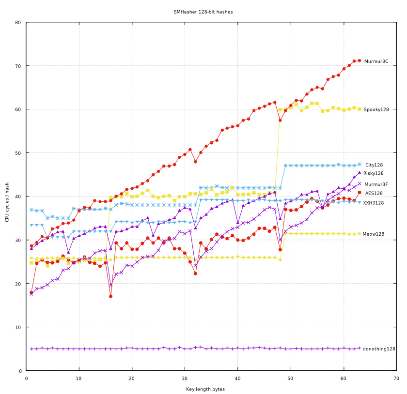

<<<<<<< HEAD
This is smhasher with a couple of hashes I added.

1. [AESTest.cpp](src/AESTest.cpp) and [AESHash.h](src/AESHash.h) are AES based hashes, these
require AES and AVX support on x64.

2. [RiskyTest.cpp](src/RiskyTest.cpp) and [RiskyHash.h](src/RiskyHash.h) are hashes derived from
[facil.io](https://github.com/boazsegev/facil.io) located in [fio.h](https://github.com/boazsegev/facil.io/blob/master/lib/facil/fio.h).

I also modified the Speed test to repeat the small hashes 16 times in order to
show the cycles when the hash is hot in the CPU.  The old way that SMHasher was
doing it, caused the overhead of the timing code to dominate the overall time.
This is unrealistic in real life, but it shows the differences between the
hashes a bit more clearly.  Also, cycle times on the order of nanoseconds
rarely makes that big of a difference.  What is more likely is that the memory
latency of loading the key will dominate the time of the hash.

Here are graphs for the 64 bit and 128 bit hashes as run on a i9-7960X
(skylake) using these gnuplot scripts: [plot64.gnuplot](plot64.gnuplot)
and [plot128.gnuplot](plot128.gnuplot).

To use the plot scripts, load them in gnuplot like this (I'm using Fedora 28):

```console
[5875]; git clone https://github.com/injinj/smhasher
[5876]; cd smhasher
[5877]; cmake src
[5878]; make
[5879]; gnuplot-qt

        G N U P L O T
        Version 5.0 patchlevel 6    last modified 2017-03-18

        Copyright (C) 1986-1993, 1998, 2004, 2007-2017
        Thomas Williams, Colin Kelley and many others

        gnuplot home:     http://www.gnuplot.info
        faq, bugs, etc:   type "help FAQ"
        immediate help:   type "help"  (plot window: hit 'h')

Terminal type set to 'qt'
gnuplot> load "plot64.gnuplot"
donothing64
City64
Spooky64
AES64
Risky64
Murmur2B
Murmur2C
gnuplot> load "plot128.gnuplot"
donothing128
City128
Spooky128
AES128
Risky128
Murmur3C
Murmur3F
```




Original SMHasher Readme:

=======
>>>>>>> 88e89762ea2e429040f7c235c5304cdb978a236e
## [SMHasher](https://github.com/aappleby/smhasher/wiki) is a test suite designed to test the distribution, collision, and performance properties of non-cryptographic hash functions.

This is the home for the [MurmurHash](https://github.com/aappleby/smhasher/tree/master/src) family of hash functions along with the [SMHasher](https://github.com/aappleby/smhasher/tree/master/src) test suite used to verify them. SMHasher is released under the MIT license. All MurmurHash versions are public domain software, and the author disclaims all copyright to their code.

SMHasher is a test suite designed to test the distribution, collision, and performance properties of non-cryptographic hash functions - it aims to be the [DieHarder](http://www.phy.duke.edu/~rgb/General/dieharder.php) of hash testing, and does a pretty good job of finding flaws with a number of popular hashes.

The SMHasher suite also includes [MurmurHash3](https://github.com/aappleby/smhasher/blob/master/src/MurmurHash3.cpp), which is the latest version in the series of MurmurHash functions - the new version is faster, more robust, and its variants can produce 32- and 128-bit hash values efficiently on both x86 and x64 platforms.


## Updates

### 1/8/2016

Woo, we're on Github! I've been putting off the migration for a few, uh, years or so, but hopefully Github won't be shutting down any time soon so I don't have to move things again. MurmurHash is still used all over the place, SMHasher is still the defacto hash function test suite, and there are all sorts of interesting new hash functions out there that improve bulk hashing speed and use new shiny hardware instructions for AES and whatnot. Interesting times. :)

I've copied the few wiki pages from code.google.com/p/smhasher to this wiki, though I haven't reformatted them to Markdown yet. The MurmurHash page on Wikipedia should also be linking here now as well. Feel free to send me pull requests.
